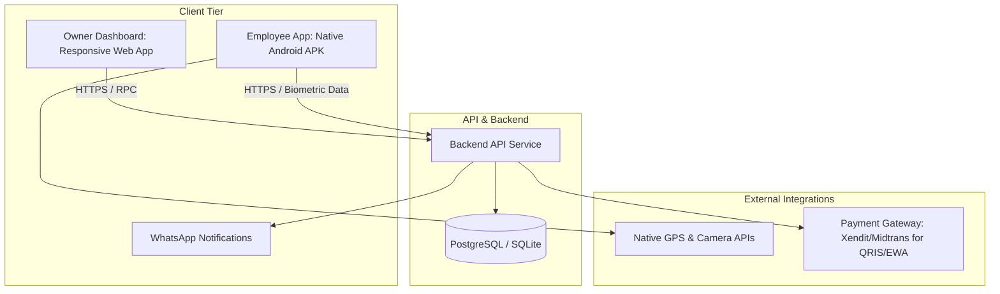
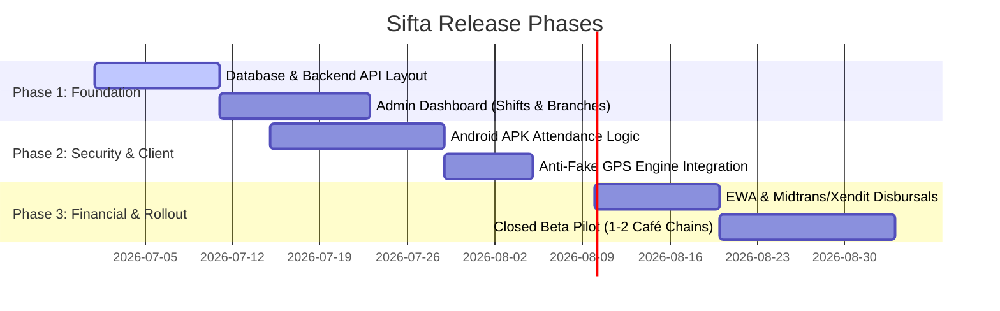

# Product Requirement Document (PRD)
## Project Sifta: Niche-Disruptive Blue-Collar HRIS for Indonesia

---

### 1. Document Control
| Detail | Value |
| :--- | :--- |
| **Project Name** | Sifta (Sifta.id) |
| **Target Market** | Indonesia (F&B, Retail, Light Manufacturing, Warehousing) |
| **Author** | Antigravity AI |
| **Status** | Draft (Review Ready) |
| **Date** | June 26, 2026 |

---

### 2. Introduction & Product Vision

#### Why build Sifta when there are established competitors (Mekari, Talenta, Sleekr)?
In the Indonesian SaaS ecosystem, major HRIS platforms are built for **white-collar office workers**. They assume employees sit at desks, have corporate email addresses, use high-end smartphones, work standard 9-to-5 schedules, and receive fixed monthly salaries. 

This leaves a massive gap in the market. **Blue-collar sectors (F&B, Retail, Warehousing, Factories)** operate in a fundamentally different reality:
*   **High Employee Turnover:** Frequently replacing staff means onboarding must take 5 minutes, not days.
*   **Complex Shift Rosterings:** Work hours fluctuate across morning, night, weekend, and overtime shifts, often split across multiple branches.
*   **Fraud Vulnerability:** Workers frequently bypass geofencing using mock locations (Fake GPS) to mark attendance.
*   **Financial Urgency:** Daily wage or weekly payout structures are common. Workers often need salary advances (kasbon) to cover daily emergencies.
*   **Device Constraints:** Low-spec Android devices with full storage are the norm.

**Sifta's Core Value Proposition:**
> *"Manage shifts, secure attendance, and process payroll for field workers in one click—without Excel formulas, fake GPS drama, or manual cash advances."*

---

### 3. Competitor Gap Analysis (The Sifta Moat)

Sifta does not try to out-feature enterprise giants. Instead, we win by being specialized, fast, and simple:

| Strategic Dimension | Competitor (Generalist Enterprise HRIS) | Sifta (Niche Blue-Collar HRIS) |
| :--- | :--- | :--- |
| **Target Niche** | Corporate Offices / White-Collar | F&B, Retail, Light Manufacturing, Franchisees |
| **User Experience (UX)** | Heavy, multi-layered dashboard requiring training | 1-click attendance on mobile, drag-and-drop shift planner on web |
| **Anti-Fraud Security** | Standard GPS validation (easily spoofed) | Native OS-level Fake GPS block + Facial Recognition |
| **Shift Management** | Fixed/Simple shifts; hard to change dynamically | Fluid multi-branch rosters with instant WhatsApp notifications |
| **Payroll Model** | Standard monthly payroll | Micro-payroll: hourly/daily base, late-fines per minute, daily EWA |
| **Earned Wage Access (EWA)** | Rarely integrated or requires 3rd party fintech | Integrated direct instant-cashout (Kasbon) |
| **Customer Support** | Ticket-based email or automated bot routing | WhatsApp Business support (Direct human-in-the-loop) |

---

### 4. Branding & Design System

Sifta's visual design communicates **efficiency, transparency, and approachability**. 

#### 4.1. Branding Logo
Below is the modern vector logo representing Sifta, reflecting scheduling connectivity (S-loop) and time efficiency:


#### 4.2. Color Palette
To maintain a professional yet modern look, we employ a clean slate background with sharp accents:

*   **Primary Navy (#1B263B):** Trustworthy, clean structural color. Used for sidebar navigation and headings.
*   **Primary Teal (#00ADB5):** Brand highlight. Used for primary buttons, active states, and calendar indicators.
*   **Success Emerald (#06D6A0):** Used for "Checked In" status, approved cashouts, and positive trends.
*   **Alert Amber (#FFD166):** Used for "Late" markers, pending approvals, and warning notifications.
*   **Neutral Dark (#222831):** Body text and secondary interfaces.
*   **Neutral Light (#F8F9FA):** Dashboard canvas background.

#### 4.3. Design Principles
*   **Mobile-First for Workers:** UI consists of large, fat touch targets. Avoid dropdown menus for inputs; use clear selector cards.
*   **Admin Dashboard Simplicity:** Single-page dashboard highlighting only three numbers: *Who is working now? Who is late today? What is the current daily payroll run rate?*

---

### 5. Technical & Deployment Strategy

To launch quickly, keep costs low, and maximize application stability, we utilize a **Hybrid Split Architecture**:



1.  **For Owners/Admins:** A responsive **React / Next.js Web App** deployed on Vercel or Cloudflare Pages. This requires no store downloads and is immediately accessible from laptops or phone browsers.
2.  **For Employees:** A lightweight **React Native / Flutter Android App** distributed initially as an **APK download** (sent via WhatsApp/Drive link) or published to Google Play. 
    > [!IMPORTANT]
    > A native Android application is mandatory because web browsers (PWA) cannot access low-level OS APIs to check if a user is running Fake GPS mock-location software or if the phone has been rooted/jailbroken.

---

### 6. Functional Specifications (MVP Core Pillars)

```
                       ┌───────────────────────────────┐
                       │          SIFTA MVP            │
                       └───────────────┬───────────────┘
                                       │
         ┌─────────────────────────────┼─────────────────────────────┐
         ▼                             ▼                             ▼
┌──────────────────┐          ┌──────────────────┐          ┌──────────────────┐
│ Attendance Pillar│          │ Scheduling Pillar│          │  Payroll & EWA   │
└────────┬─────────┘          └────────┬─────────┘          └────────┬─────────┘
         │                             │                             │
         ├─ Geofencing (20m)           ├─ Drag-and-Drop Builder      ├─ Pay-per-hour / shift
         ├─ Anti-Fake GPS check        ├─ Multi-Branch Sync          ├─ Auto late denda
         ├─ Face Lock (In-App Cam)     └─ WhatsApp Schedule Push     └─ Instant Kasbon (EWA)
         └─ Offline Sync Storage
```

#### Pillar 1: Smart Anti-Fraud Attendance
The main friction point for employers is attendance cheating.

*   **Geofencing Lock:** Employee must be within $X$ meters (default: 20 meters) of the branch's GPS coordinates to check in.
*   **Anti-Fake GPS Engine:**
    *   Query native Android `Location.isFromMockProvider()` flags.
    *   Scan active processes for known mock-location applications (e.g., "Fake GPS location").
    *   Block check-in action if any mock provider is active.
*   **Facial Recognition (Photo Verification):** Instead of complex AI models initially, the app captures a quick selfie during clock-in and saves it to Cloudflare R2 / S3. The manager can audit these photos from the dashboard.
*   **Offline Mode:** If cellular network is down, store check-in timestamp and photo securely in local SQLite/watermelondb. Sync automatically once connection is re-established.

#### Pillar 2: Dynamic Shift & Roster Scheduler
Managers in F&B and retail spend hours coordinate rosters over WhatsApp chat.

*   **Visual Shift Scheduler:** A calendar grid where managers can drag and drop shifts onto employees.
*   **Multi-Branch Sync:** Allows managers to assign Employee A to "Branch X" on Monday and "Branch Y" on Tuesday without roster overlap or database collisions.
*   **WhatsApp Notification Push:** Integrating an automated gateway (like Whatsapp API / Twilio) to blast out the weekly shift roster directly to employee WhatsApp numbers every Sunday.

#### Pillar 3: Micro-Payroll & Instant Cash-out (EWA)
Simplifying calculations and worker motivation.

*   **Flexible Pay Calculations:** Support for hourly rates, shift rates, and fixed monthly salaries.
*   **Deductions & Incentives:**
    *   *Denda Telat:* Auto-calculate late deductions per minute (e.g., Rp2,000 deduction per minute late).
    *   *Insentif:* Daily bonuses triggered if shift target is achieved.
*   **Earned Wage Access (EWA / Kasbon Instan):**
    *   Calculate "Earned Wages" in real-time. E.g., if a worker's daily salary is Rp150,000, and they have worked 5 days this month, they have an accumulated Earned Wage of Rp750,000.
    *   The worker can request an instant cashout of up to 50% of their earned wage (Rp375,000).
    *   Upon approval (or auto-approval limits set by the owner), the payout is routed via a local payment gateway (Xendit/Midtrans API) directly to the worker's bank or e-wallet (GoPay, OVO, Dana).
    *   Cashout amount is automatically deducted from the final monthly bank payout.

---

### 7. Database Entity Relationship Model (ERD Outline)

To implement this project, we structure the relational database as follows:

```
[Company] 1 ──── ──* [Branch] (lat, lng, radius)
   │                    │
   │                    └──* [ShiftSchedule] (date, start_time, end_time)
   │                            │
   └──────────* [Employee] ─────┘
                 │   │
                 │   └──────* [Attendance] (clock_in_time, clock_out_time, is_mock_gps, photo_url)
                 │
                 └──────────* [CashoutRequest] (amount, requested_at, status, payout_id)
```

#### Schema Tables:

1.  **`companies`**
    *   `id` (UUID, PK)
    *   `name` (VARCHAR)
    *   `created_at` (TIMESTAMP)

2.  **`branches`**
    *   `id` (UUID, PK)
    *   `company_id` (UUID, FK -> companies.id)
    *   `name` (VARCHAR)
    *   `latitude` (DECIMAL)
    *   `longitude` (DECIMAL)
    *   `geofence_radius_meters` (INT, default 20)

3.  **`employees`**
    *   `id` (UUID, PK)
    *   `company_id` (UUID, FK -> companies.id)
    *   `name` (VARCHAR)
    *   `phone_number` (VARCHAR, unique)
    *   `hourly_rate` (DECIMAL)
    *   `bank_account_number` (VARCHAR)
    *   `bank_code` (VARCHAR)

4.  **`shift_schedules`**
    *   `id` (UUID, PK)
    *   `employee_id` (UUID, FK -> employees.id)
    *   `branch_id` (UUID, FK -> branches.id)
    *   `date` (DATE)
    *   `expected_clock_in` (TIME)
    *   `expected_clock_out` (TIME)
    *   `status` (VARCHAR: 'scheduled', 'completed', 'absent')

5.  **`attendances`**
    *   `id` (UUID, PK)
    *   `shift_schedule_id` (UUID, FK -> shift_schedules.id)
    *   `employee_id` (UUID, FK -> employees.id)
    *   `clock_in` (TIMESTAMP)
    *   `clock_out` (TIMESTAMP, nullable)
    *   `clock_in_lat` (DECIMAL)
    *   `clock_in_lng` (DECIMAL)
    *   `clock_in_photo_url` (VARCHAR)
    *   `is_fake_gps_detected` (BOOLEAN)

6.  **`cashout_requests`**
    *   `id` (UUID, PK)
    *   `employee_id` (UUID, FK -> employees.id)
    *   `amount` (DECIMAL)
    *   `status` (VARCHAR: 'pending', 'approved', 'disbursed', 'rejected')
    *   `payment_reference` (VARCHAR)
    *   `requested_at` (TIMESTAMP)

---

### 8. Release Roadmap (Phased Development)



*   **Phase 1: Roster Foundation (Month 1)**
    *   Build base API and admin dashboard.
    *   Implement Shift Scheduler (Drag and Drop).
*   **Phase 2: Attendance Security (Month 1.5)**
    *   Release Android APK.
    *   Deliver Geofencing and Fake GPS blocker library.
*   **Phase 3: Financial Integration (Month 2)**
    *   Implement local disbursement API.
    *   Launch Pilot testing with 2 friendly F&B/franchise business owners.
